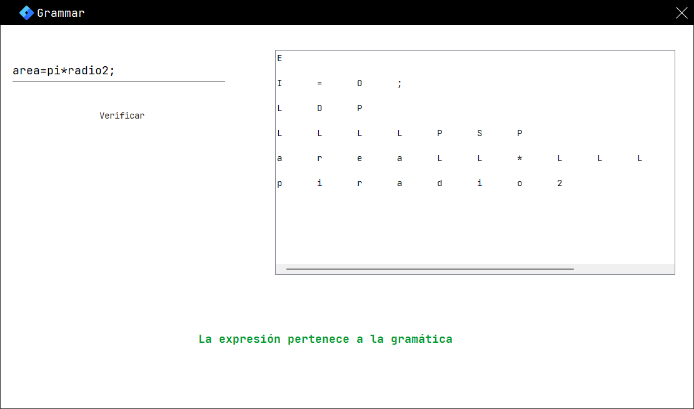

# Grammar 

### Grammar analyzer made with pushdown automaton

The program takes as input an expression in the Java programming language and validates it based on a grammar. A pushdown automaton is used to verify the validity of the expression.
The derivation tree is generated taking into account the elements of the grammar
 

